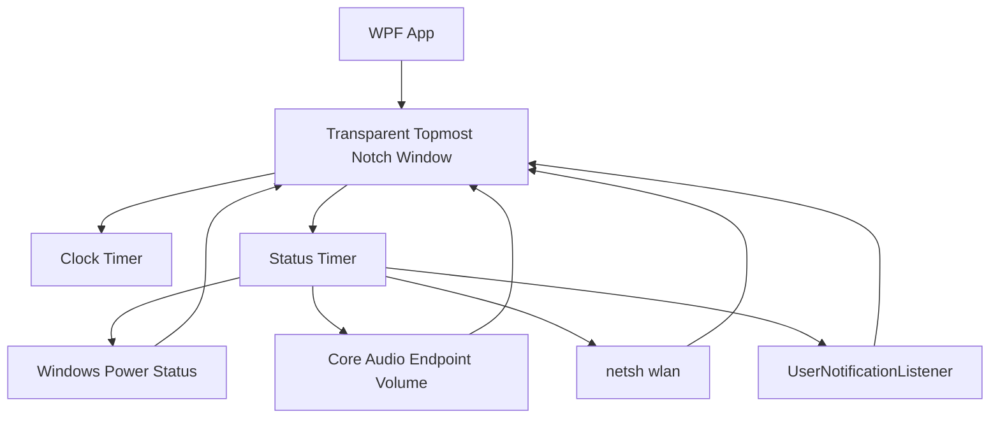
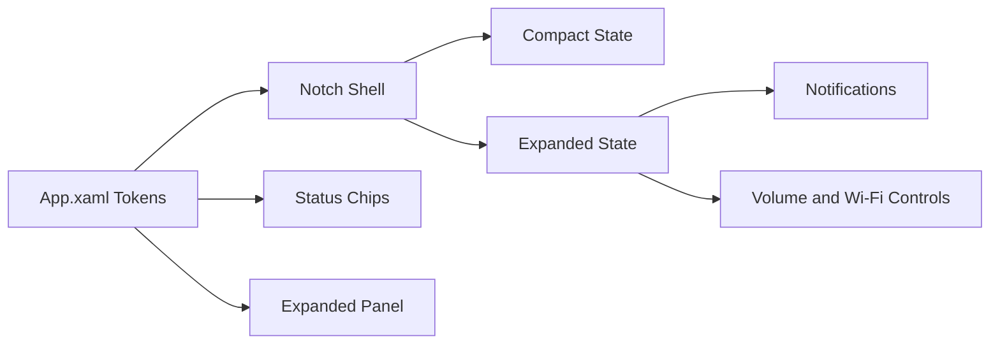

# Winotch Architecture

## Runtime Flow

## UI System

## Design Tokens

- `NotchBlack`: shell background
- `NotchPanel`: chip/control background
- `NotchText`: primary text
- `NotchMutedText`: secondary text
- Typography: Segoe UI Variable Text, falling back to Segoe UI
- Icons: Segoe MDL2 Assets

## Motion

The resting notch is a compact top-attached pill. Hover and notification activity expand width, height, and detail opacity with a short ease-out animation, matching the supplied reference direction without adding a custom animation engine.
